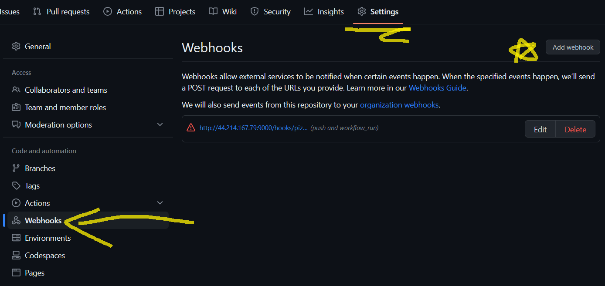
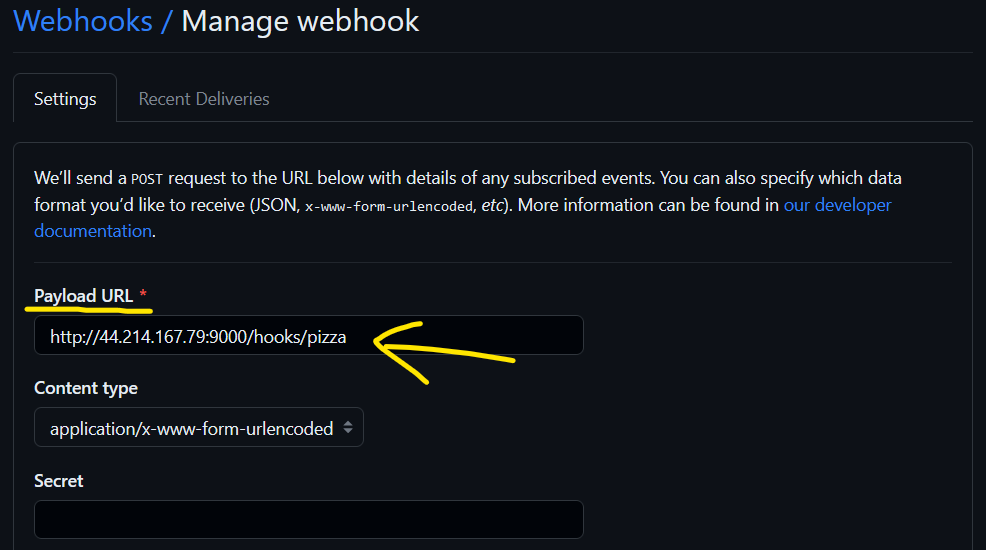
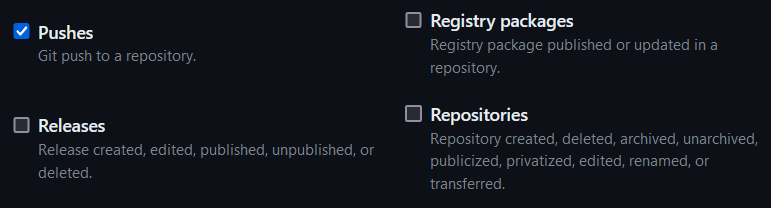
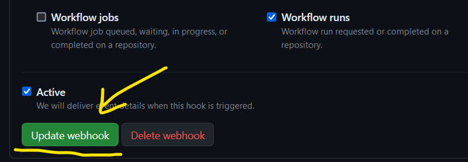

# Project 5 - James Nagy

## Part 1: Semantic Versioning

### CD Project Overview

The goal of this project is to add semantic versioning to our images using `git tag` metadata in GitHub's Actions. This will be done by editing our workflow.yml file to trigger an action when a tag is pushed.We'll also be pushing our tags to DockerHub using `docker/metadata-action` in our workflow.yml file.  The second goal is to keep production up to date using webhooks. This will be done via an EC2 instance using our DockerHub image, a script to pull new images, and a webhook. 


### How to generate a `tag` in `git` / GitHub

Generating a `tag` in GitHub is done with the command `git tag -a v1.2.0`. The tag v1.2.0 represents the version number. With the 1 representing a MAJOR version, the 2 a MINOR version, and the 0 a PATCH version. A MAJOR version change (from 1.0.0 to 2.0.0 for example) is when you make conflicting API modifications. A MINOR version change (1.1.0 to 1.2.0) is when you include some functionality in a backwards compatible way. And finally, a PATCH version change (1.0.0 to 1.0.1) is usually a small bug fix. Overall, this will generate a tag in GitHub, but it won't trigger an Action nor will it add a version to our Dockerhub image. 


### Behavior of GitHub workflow

To do this, we need to make some changes to our workflow.yml file. The first change we need to make is to have an Action trigger when we push a new tag.

```yml
on:
  push:
    branches:
      - "main"
    tags:
      - "v*.*.*"
```
  
Not only do we want our Action to trigger when there's a push to main, but also when a new tag is pushed. So, we add `tag:` followed by the type of tag we want it to look for. In our case, we'll be using semantic versioning. It will look for a tag with the format "v(Major number).(Minor number).(Patch number)".

Next, we need to collect `tag` data for DockerHub. 

```yml
- name: Collecting tag data
        id: meta
        uses: docker/metadata-action@v4
        with:
          # Docker image to use as a base name for our tags
          images: |
            nagyjames/project4
          # this will generate our Docker tags based on these attributes
          tags: |
            type=semver,pattern={{major}}
            type=semver,pattern={{major}}.{{minor}}
```

  This will generate a set of tags from our repository. 

```yml
- name: Build and push Docker image
        uses: docker/build-push-action@v4
        with:
          context: .
          push: true
            # tags: nagyjames/project4:latest
          tags: ${{ steps.meta.outputs.tags }}
          labels: ${{ steps.meta.outputs.labels }} 
```

  And finally, this will build and push our Docker image with our new tag that we've created using the set of tags generated with `docker/metadata-action`.


### Link to DockerHub repository (as additional proof)
[dockerhub repo](https://hub.docker.com/repository/docker/nagyjames/project4/general)


## Part 2 - Deployment


### How to install Docker to your instance

Installing Docker on your instance is as easy as CRTL-C, CRTL-V.
* First, make sure your system is up to date by running the command `sudo apt-get update`.
* Next, install Docker with this command `sudo apt install docker.io`.
* Now, install all of the dependency packages `sudo snap install docker`
* Finally, check your version and you're good to go `docker --version`


### Container restart script

The container restart gives us an easy way to manipulate our docker images and can save us a lot of time. Instead of typing out each docker command when we want to stop, pull, or run an image, we can use this script to do that for us. This script will stop a specified docker image if it's running, remove it, pull the latest image from DockerHub, and finally run the new image. 

Currently on my instance, the `restart.sh` script is just sitting in my home directory. Not the best place to have an executable file. If someone were to use my instance, by default, the script should be placed in `/usr/local/bin`.


### Setting up a `webhook` on the instance

We will be installing [adnanh's webhook](https://github.com/adnanh/webhook) on our instance. To do this, use the command `sudo apt-get install webhook`. 

To start the webhook, use the command `webhook -hooks /etc/webhook.conf -verbose`. Since our instance will auto-shutdown every 4 hours, we need a way for the webhook to automatically restart when the instance boots up.

To do this, we need to head over to the `/etc/systemd/system` directory and create a file called `webhook.service`. In this file, we need to add the following content:

```service
[Unit]
Description="this is a service for the pizza webhook"

[Service]
ExecStart=/usr/bin/webhook -hooks /etc/webhook.conf -hotreload

[Install]
WantedBy=multi-user.target
```

To test and see if this works, run the command `sudo reboot`. Then once it's back up, run the command `sudo service webhook status` to see if our webhook is running. You should see output like the following:

```
ubuntu@ip-10-0-0-25:/etc/systemd/system$ sudo service webhook status
● webhook.service - "this is a service for the pizza webhook"
   Loaded: loaded (/etc/systemd/system/webhook.service; enabled; vendo
   Active: active (running) since Sun 2023-04-09 19:35:40 UTC; 2h 43mi
 Main PID: 833 (webhook)
    Tasks: 7 (limit: 1134)
   CGroup: /system.slice/webhook.service
           └─833 /usr/bin/webhook -hooks /etc/webhook.conf -hotreload
```


### `webhook` task definition file

The webhook task definition file allows us to define hooks we want our webhook to serve. The file in question:

```conf
[
  {
    "id": "pizza",
    "execute-command": "/home/ubuntu/restart.sh",
    "command-working-directory": "/var/webhook"
  }
]
```

This file defines a hook named `pizza` that will run a restart script which is located in `/home/ubuntu/restart.sh`. (Remember what I said earlier, this executable shouldn't be there...).

This webhook task definition file should be in the `/etc/webhook.conf` directory. 


### How to configure GitHub OR DockerHub to message the listener

The first thing you'll want to do is head over to your Github repo. Under the Settings tab, click on the left where it says `Webhooks`. Under this menu, you'll want to click where it says `Add webhook` to get started. 



You should see a new menu now, look where it says `Payload URL`. This is where we want to add our URL with the format "http://[Public_IP]:9000/hooks/[hook_name]"



Scroll down a bit and you should see where it says "Which events would you like to trigger this webhook?" Click where it says "Let me select individual events."


Find where it says "Pushes" and check that box.



Now, scroll down all the way and check the box where it says "Workflow runs". Finally, click `Update webhook` and you're done!

 

### RECORD your whole workflow process - from `commit` and `push` to your instance getting a fresh image

(https://youtu.be/RioTDPDQaFU)

## Part 3 - Diagramming

