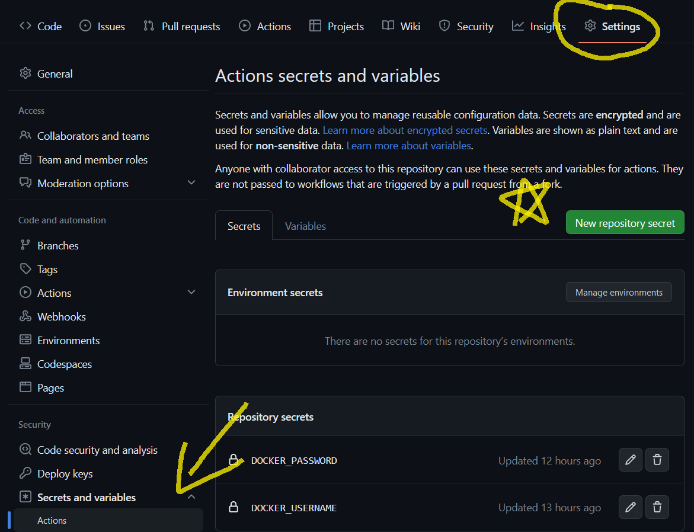
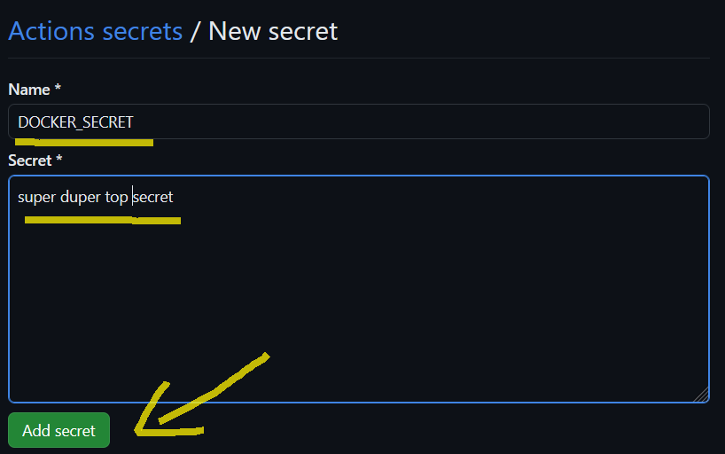
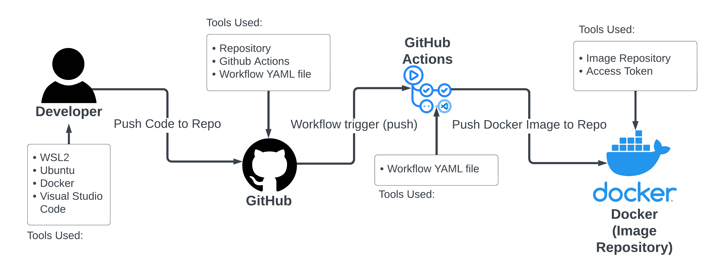

# Project 4 - James Nagy

## Part 1: Dockerize it

### CI Project Overview
* Using docker, I am creating a container image that will run a website which will use apache2 as a webserver. This will create an isolated and restricted box that will allow my website to run. Running this website on a container grants us the security and resource management attributes of Virtual Machines, and saves us the expense of having to run a whole new operating system. 

### Run Project Locally
* How to install docker + dependencies:
  * First, you'll want to install Docker if you haven't already. Using this command we can install it: `sudo apt install docker.io`. 
  * Once Docker is installed, we need to build an image from the Dockerfile. We can create a blank Dockerfile using the command, `vim Dockerfile` or `touch Dockerfile`. Now we can edit the Dockerfile so it can build our image. Using the following code, we can build our container image: 

```dockerfile
FROM ubuntu

RUN apt update 
RUN apt install -y apache2 
RUN apt install -y apache2-utils 
RUN apt clean

ENV APACHE_RUN_USER www-data
ENV APACHE_RUN_GROUP www-data
ENV APACHE_LOG_DIR /var/log/apache2
ENV APACHE_RUN_DIR /var/www/html

WORKDIR /var/www/html

COPY website .

# RUN echo 'Hello, docker' > /var/www/index.html

ENTRYPOINT ["/usr/sbin/apache2"]
CMD ["-D", "FOREGROUND"]
```

  * Make sure to save & exit your file. Now we can build our image using the command: `docker build -t website_image:1.0 .`. 

  * Once the image is built successfully, we can run the container image using the command, `docker run --name mywebsite -d -p 80:80 website_image:1.0`. To see that the container is running successfully, use the command, `docker ps -a`. You should see your container listed in the output like so (output may vary):
```
CONTAINER ID   IMAGE               COMMAND                  CREATED         STATUS         PORTS                NAMES
010b780fe75c   website_image:1.0   "/usr/sbin/apache2 -…"   7 minutes ago   Up 7 minutes   0.0.0.0:80->80/tcp   mywebsite
```

  * To view the website running on the container we created, simply go to your browser of choice and enter the following in the URL menu: `localhost:80`, `localhost`, `127.0.0.1`, or `127.0.0.1:80`. Any of these should work. Now, you can view the fruits of your labor in your browser!


## Part 2: GitHub Actions and DockerHub

* Process to create public repository in DockerHub:
  * Creating a public repo in DockerHub is fairly simple. But it does involve a few steps. Once you've created an account on DockerHub, head over to the tab called "Repositories". Then, look for the big blue button which says, "Create Repository", then click it. FIll the repository name field with an easy to remember name for your repo and a description if you wish. Once you're done, click on "Create". Yeah, that it, you've made a repo!

* How to authenticate with DockerHub via CLI using Dockerhub credentials:
  * This is done using the command, `docker login --username demo --password example`. Where `demo` is your DockerHub username and `example` is your password. However, I do recommend using an access token instead of your password, for security reasons.

* How to push container image to Dockerhub (without GitHub Actions):
  * In order to push container images, we need to first tag the image using the command, `docker image tag imageName dockerhubUsername/imageName:latest`. Now we can push the image to DockerHub using the command, `docker image push dockerhubUsername/imageName:latest`

* Configuring GitHub Secrets:
  * To set a secret on GitHub, you'll want to head to the Settings tab in your repo. On the left side of your screen, you should see a menu with `General`, `Access`, `Code and automation`, and `Security`. Look under Security and you should see an option called, `Secrets and Variables`. Click this dropdown and select `Actions`. Once we're in `Action secrets and variables`, we'll want to select `New repository secret`. (The big, green button!) 



  Once we're in the `New secret` menu, we can add a new secret. This can be a username, password, or an access token. Give your secret a name using all caps and underscores for spaces. Then, place your secret in the `Secret` field. Make sure the spelling of your secret is correct and once you're finished, click the `Add secret` button and you're done!



  * There are two secrets set for this project. We created a secret for our DockerHub username and password (or a token, which is a better option than using a password). I used my DockerHub username and an access token for my project. 

* Behavior of GitHub workflow
  * A workflow is an automated, customizable process that can run one or more jobs. Workflows are established with a YAML file that is checked into your repository. These workflows can be run when triggered by an event in your repository, manually, or on a schedule. 

  * In this project, my workflow is triggered whenever I push onto my main branch. Two custom variables that this project uses is `${{ secrets.DOCKER_USERNAME }}` and `${{ secrets.DOCKER_PASSWORD }}`. These two variables reference the secrets we created earlier and are used to login to our DockerHub account. This last feature allows us to push images to our DockerHub account. In my YAML file for the workflow, I have the following code:

```yaml
- name: Build and push Docker image
        uses: docker/build-push-action@ad44023a93711e3deb337508980b4b5e9bcdc5dc
        with:
          push: true
          tags: nagyjames/project4:latest
```

  The `tags:` option gives our Docker image that we've pushed a tag called `latest`. This will apply to all image versions that we push.

   

## Part 3: Diagramming


