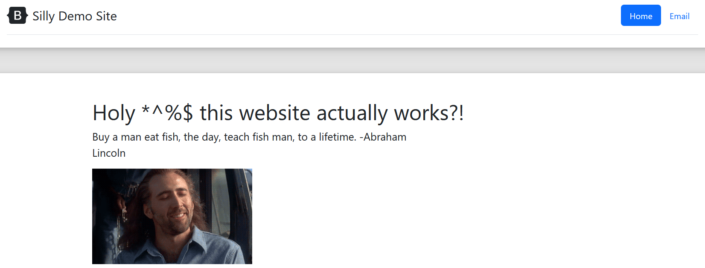

# Project 4 - James Nagy

## Part 1: Dockerize it

### CI Project Overview
* Using docker, I am creating a container image that will run a website which will use apache2 as a webserver. This will create an isolated and restricted box that will allow my website to run. Running this website on a container grants us the security and resource management attributes of Virtual Machines, and saves us the expense of having to run a whole new operating system. 

### Run Project Locally
* How to install docker + dependencies:
  * First, you'll want to install Docker if you haven't already. Using this command we can install it: `sudo apt install docker.io`. 
  * Once Docker is installed, we need to build an image from the Dockerfile. We can create a blank Dockerfile using the command, `vim Dockerfile` or `touch Dockerfile`. Now we can edit the Dockerfile so it can build our image. Using the following code, we can build our container image: 

```dockerfile
FROM ubuntu

RUN apt update 
RUN apt install -y apache2 
RUN apt install -y apache2-utils 
RUN apt clean

ENV APACHE_RUN_USER www-data
ENV APACHE_RUN_GROUP www-data
ENV APACHE_LOG_DIR /var/log/apache2
ENV APACHE_RUN_DIR /var/www/html

WORKDIR /var/www/html

COPY website .

# RUN echo 'Hello, docker' > /var/www/index.html

ENTRYPOINT ["/usr/sbin/apache2"]
CMD ["-D", "FOREGROUND"]
```

  * Make sure to save & exit your file. Now we can build our image using the command: `docker build -t website_image:1.0 .`. 

  * Once the image is built successfully, we can run the container image using the command, `docker run --name mywebsite -d -p 80:80 website_image:1.0`. To see that the container is running successfully, use the command, `docker ps -a`. You should see your container listed in the output like so (output may vary):
```
CONTAINER ID   IMAGE               COMMAND                  CREATED         STATUS         PORTS                NAMES
010b780fe75c   website_image:1.0   "/usr/sbin/apache2 -…"   7 minutes ago   Up 7 minutes   0.0.0.0:80->80/tcp   mywebsite
```

  * To view the website running on the container we created, simply go to your browser of choice and enter the following in the URL menu: `localhost:80`, `localhost`, `127.0.0.1`, or `127.0.0.1:80`. Any of these should work. Now, you can view the fruits of your labor in your browser!



## Part 2: GitHub Actions and DockerHub

### Process to create public repository in DockerHub

## Part 3: Diagramming
